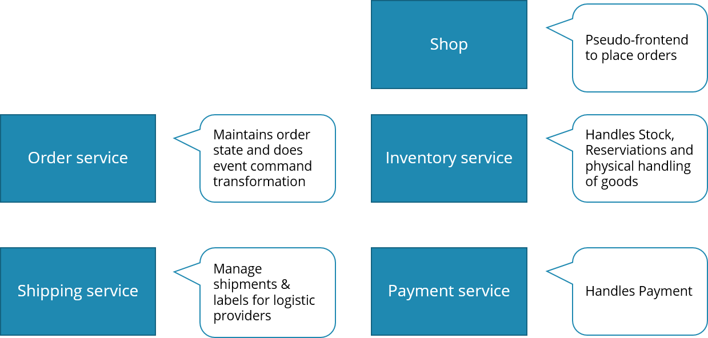
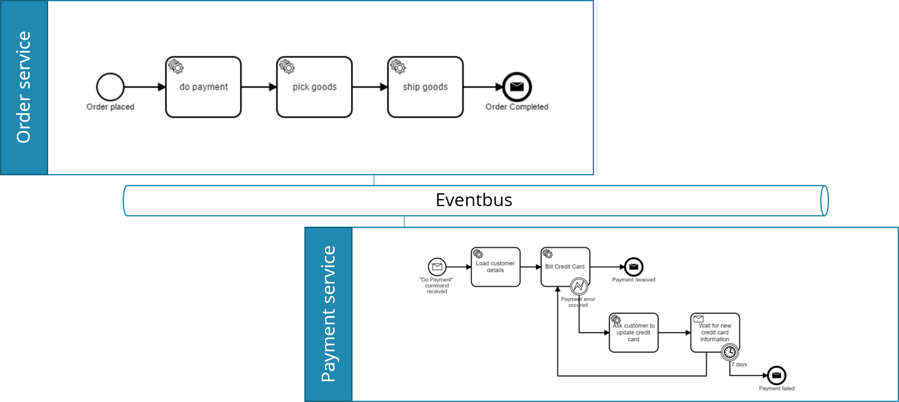

# Sample microservices implementing order fulfillment

This sample application shows how to implement

* a simple order fulfillment system

in the context of

* Domain Driven Design (DDD)
* Event Driven Architecture (EDA)
* Microservices (µS)

with the concrete technologies/frameworks:

* Java
* Spring Boot
* Spring Cloud Streams
* Camunda
* Kafka

# Links

* Introduction blog post by Bernd Rücker: https://blog.bernd-ruecker.com/flowing-retail-demonstrating-aspects-of-microservices-events-and-their-flow-with-concrete-source-7f3abdd40e53

# Overview and architecture

Flowing retail simulates a very easy order fulfillment system. The business logic is separated into the following microservices:



* The core domains communicate via messages with each other.
* Messages might contain *events* or *commands*.

Note that every component does its own parts of the overall order fulfillment capability. As an example this is illustrated using BPMN and showing the Order and Payment Service with their processes:




# Run the application

* Download or clone the source code
* Run a full maven build

```
mvn install
```

* Install and start Kafka on the standard port
* Create topic *"flowing-retail"* (TODO: Auto Creation by Spring)

```
kafka-topics.sh --create --zookeeper localhost:2181 --replication-factor 1 --partitions 1 --topic flowing-retail
```

* You can check & query all topics by: 

```
kafka-topics.sh --list --zookeeper localhost:2181
```

* Start the different microservices components by Spring Boot one by one
    
```
mvn -f checkout exec:java
...
```

You can also import the projects into your favorite IDE and start the following class yourself:

```
checkout/io.flowing.retail.java.CheckoutApplication
...
```

* Now you can place an order via [http://localhost:8090](http://localhost:8090)
* You can inspect the order VPMN via [http://localhost:8091](http://localhost:8091)
* You can inspect all events going on via [http://localhost:8095](http://localhost:8095)

