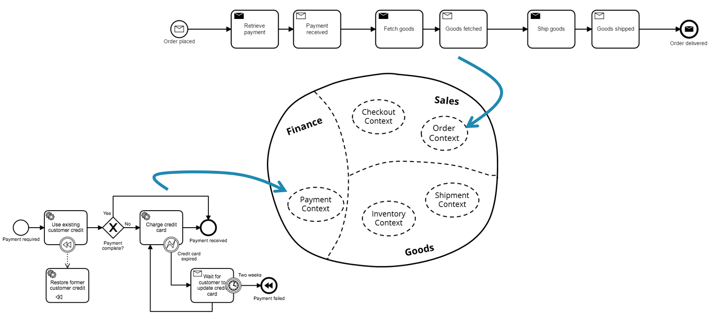

# Flowing Retail

This sample application demonstrates a simple order fulfillment system decomposed into multiple independant components (e.g. microservices).

There is code for multiple implementation alternatives to allow a broad audience to undestand the code or to compare alternatives. The table below lists these alternatives.

The example respects learnings from **Domain Driven Design (DDD)**, Event Driven Architecture (EDA) and **Microservices (µS)** and should give you a very hands-on access to certain topics.

**Note:** The code was written in order to be explained. Hence I favored simplified code or copy & paste over production-ready code with generic solutions. **Don't consider the coding style best practice! It serves the purpose to have easily explainable code**.

Flowing retail simulates a very easy order fulfillment system:

## Architecture and implemenation alternatives

The most fundamental choice is to select the **communication mechanism**:

* **[Apache Kafka](kafka/)** as event bus (could be easily changed to messaging, e.g. RabbitMQ): 
* **[REST](rest/)** communication between Services
  * This example also shows how to do **stateful resilience patterns** like **stateful retries** leveraging a workflow engine
* **[Zeebe](zeebe/)** broker doing work distribution

Having chosen that your probably can choose the **workflow engine**:

* **Camunda BPM 7**
* **Zeebe** (if you are interested why Zeebe is listed in the communication mechanism as well as workflow engine please look into the [Zeebe example readme](zeebe/))

and the **programming language**:

* **Java**
* **Go**
* **Node.js**

## Storyline

Flowing retail simulates a very easy order fulfillment system. The business logic is separated into the services shown above (shown as [context map](https://www.infoq.com/articles/ddd-contextmapping)).

### Long running services and orchestration

Some services are **long running** in nature, as e.g. the payment service asks customers to update expired credit cards. Hence a workflow engine is used to persist and control these long running interactions.

### Workflows live within service boundaries

An important thought is, that this state machine (or workflow engine in this case) is a library used **within** one service. If different services need a workflow engine they potentally run multiple engines. This way it is an autonomous team decision if they want to use some framework and which one:

### Resilience patterns for synchronous communication

Depending on the means of communication (e.g. messaging vs. blocking synchronous REST calls) you also have to tackle quite basic communication problems, e.g. by stateful retries.

### See [REST example](rest/).

## Links and background reading

* Introduction blog post: https://blog.bernd-ruecker.com/flowing-retail-demonstrating-aspects-of-microservices-events-and-their-flow-with-concrete-source-7f3abdd40e53
* InfoQ-Writeup "Events, Flows and Long-Running Services: A Modern Approach to Workflow Automation": https://www.infoq.com/articles/events-workflow-automation
* InfoWorld article "3 common pitfalls of microservices integration—and how to avoid them": https://www.infoworld.com/article/3254777/application-development/3-common-pitfalls-of-microservices-integrationand-how-to-avoid-them.html
