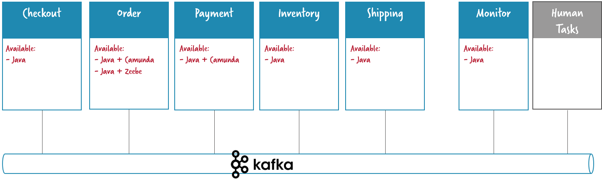

# Flowing Retail / Apache Kafka / Java

This folder contains services written in Java that connect to Apache Kafka as means of communication between the services.

Tech stack:

* Java 8
* Spring Boot 1.5.x
* Spring Cloud Streams
* Apache Kafka

For the **workflow engine** you can decide between:
* Camunda (folder \*-camunda)
* Zeebe (folder \*-zeebe)



# Run the application

You can either

* Docker Compose with pre-built images from Docker Hub (simplest)
* Build (Maven) and start via Docker Compose
* Build (Maven) and start manually (including Zookeeper, Kafka)

The default is that Camunda is used in these settings. When you want to use Zeebe you have to manually build and run it.

## Hint on using Camunda Enterprise Edition

For Camunda there is an enterprise edition available with [https://camunda.com/products/cockpit/#/features](additional features in Cockpit) (the monitoring tool). It is quite handy to use this when playing around with the example. You can easily switch to use enterprise edition:

* Get a trial license if you don't have a license yet: https://camunda.com/download/enterprise/
* Adjust Camunda version used in pom (order and payment use Camunda): [./order-camunda/pom.xml#L19](./order-camunda/pom.xml#L19), [./order-camunda/pom.xml#L69](./order-camunda/pom.xml#L69), [./payment-camunda/pom.xml#L13](./payment-camunda/pom.xml#L13) and [./payment-camunda/pom.xml#L63](./payment-camunda/pom.xml#L63)
* Note that this only works if you build the projects locally, not with the pre-build images

Note that you do not need the enterprise edition to run the examples, the community edition will also do fine, you just cannot see and do that much in Camunda Cockpit.


## Docker Compose with pre-build Docker images

* Download [docker-dist/docker-compose.yml](../../docker-dist/kafka-java-camunda/docker-compose.yml) or clone the source code
* Goto directory where you downloaded this file

```
cd docker-dist
```

* Start using docker compose:

```
docker-compose up
```

* After everything has started up you are ready to visit the overview page [http://localhost:8099](http://localhost:8099)
* You can place an order via [http://localhost:8090](http://localhost:8090)
* You can inspect insided of Order via [http://localhost:8091](http://localhost:8091)
* You can inspect insides of Payment via [http://localhost:8092](http://localhost:8092)
* You can inspect all events going on via [http://localhost:8095](http://localhost:8095)

If you like you can connect to Kafka from your local Docker host machine too. Because of so called advertised endpoints you have to map the Kafka container hostname to localhost. This is because the cluster manager of Kafka (Zookeeper) gives you his view of the Kafka cluster which containes of this hostname, even if you connected to localhost in the first place.

For example, on Windows append this entry to ```C:\Windows\System32\drivers\etc\hosts```:
```
127.0.0.1 kafkaserver
```

On Linux edit the ```/etc/hosts``` accordingly.


## Docker Compose with local build of Docker images

* Download or clone the source code
* Run a full maven build

```
mvn install
```

* Build Docker images and start them up

```
docker-compose build
docker-compose up
```

* After everything has started up you are ready to visit the overview page [http://localhost:8099](http://localhost:8099)
* You can place an order via [http://localhost:8090](http://localhost:8090)
* You can inspect insided of Order via [http://localhost:8091](http://localhost:8091)
* You can inspect insides of Payment via [http://localhost:8092](http://localhost:8092)
* You can inspect all events going on via [http://localhost:8095](http://localhost:8095)

If you like you can connect to Kafka from your local Docker host machine too. Because of so called advertised endpoints you have to map the Kafka container hostname to localhost. This is because the cluster manager of Kafka (Zookeeper) gives you his view of the Kafka cluster which containes of this hostname, even if you connected to localhost in the first place.

For example, on Windows append this entry to ```C:\Windows\System32\drivers\etc\hosts```:
```
127.0.0.1 kafkaserver
```

On Linix edit the ```/etc/hosts``` accordingly.

## Manual start (Kafka, mvn exec:java)

* Download or clone the source code
* Run a full maven build

```
mvn install
```

* Install and start Kafka on the standard port
* Create topic *"flowing-retail"*

```
kafka-topics.sh --create --zookeeper localhost:2181 --replication-factor 1 --partitions 1 --topic flowing-retail
```

* You can check & query all topics by:

```
kafka-topics.sh --list --zookeeper localhost:2181
```

* Start the different microservices components by Spring Boot one by one, e.g.

```
mvn -f checkout exec:java
mvn -f order-camunda exec:java
...
```

Here you could easily switch to use order-zeebe instead. In this case make sure that you startup your Zeebe broker and create the *default-topic* first as described in [Install Zeebe](https://docs.zeebe.io/introduction/install.html).

You can also import the projects into your favorite IDE and start the following class yourself:

```
checkout/io.flowing.retail.java.CheckoutApplication
...
```

* Now you can place an order via [http://localhost:8090](http://localhost:8090)
* You can inspect insided of Order via [http://localhost:8091](http://localhost:8091)
* You can inspect insides of Payment via [http://localhost:8092](http://localhost:8092)
* You can inspect all events going on via [http://localhost:8095](http://localhost:8095)
