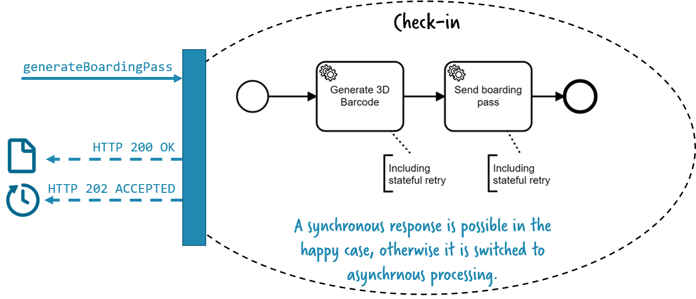
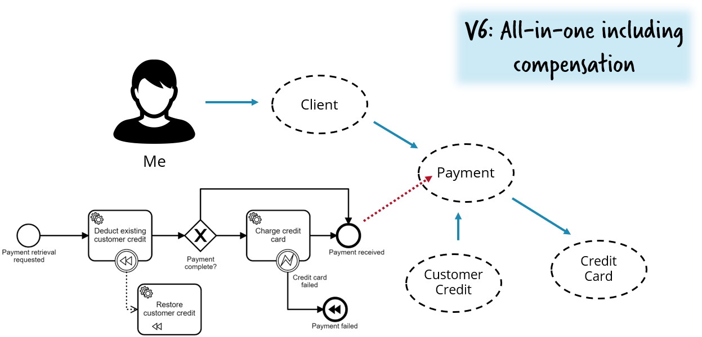

# Flowing Retail / REST

This folder contains services that connect via REST. Currently, this is reduced to showcasing resilience patterns.

# Sample service demonstrating stateful resilience patterns in a REST environment

This sample REST (micro-)service effects payments in response to a PUT call. It requires an upstream REST service that charges credit cards.


This simple call-chain is perfect for demonstrating important resilience patterns.

The following technology choices are available for the code demos:

* [**Java**](java/payment) + Spring, Hystrix, Camunda
* [**C#**](csharp/payment) + Polly, Camunda
* [**Node.js**](nodejs/payment) + [Brakes](https://github.com/awolden/brakes), Zeebe on Camunda Cloud

There is a stripped-down version available for:

* [**GoLang**](go/payment-zeebe), Zeebe


# Storyline

See **Fail fast is not enough**: https://blog.bernd-ruecker.com/fail-fast-is-not-enough-84645d6864d3

Let's assume a scenario where the upstream credit card service still responds, but its very slow. With no resilience pattern in place, this is the worst thing that can happen - as now the payment service will call the credit card service and block until it gets a response. As this take a long time, all threads from the payment service are held hostage, and the payment service will eventually time out for its clients. Tiny failures somewhere in your system might blow up your whole system:


* Java: [PaymentRestHacksControllerV1.java](java/payment/src/main/java/io/flowing/retail/payment/port/resthacks/PaymentRestHacksControllerV1.java)
* C#: [PaymentControllerV1](csharp/payment/Controllers/PaymentController.cs#L16)
* Node.js: [controller-v1.ts](nodejs/payment-zeebe/routes/controller-v1.ts)

## Fail fast

A simple mitigation is to apply a **fail fast** pattern like [**circuit breaker**](https://martinfowler.com/bliki/CircuitBreaker.html). In this example I use [Netflix Hystrix](https://github.com/Netflix/Hystrix) (_and [Polly](https://github.com/App-vNext/Polly) for C# / [Brakes](https://github.com/awolden/brakes) for Node.js, which provide equivalent functionality_). If a service responds too slowly, the circuit breaker interrupts and the payment service gets a failure right away. This way you make sure the overall system is still responding, even if functionality degrades (meaning: we cannot charge credit cards).


* Java: [PaymentRestHacksControllerV2.java](java/payment/src/main/java/io/flowing/retail/payment/port/resthacks/PaymentRestHacksControllerV2.java#L41)
* C#: [PaymentControllerV2](csharp/payment/Controllers/PaymentController.cs#L74)
* Node.js: [controller-v2.ts](nodejs/payment-zeebe/routes/controller-v2.ts#13)


## Fail fast is not enough

Failing fast is good, but it is not enough. Frequently, a retry after the credit card service has been fixed resolves the situation (if the service was in a hard failure mode) - or a retry may discover that the earlier attempt succeeded, but took an abnormal amount of time (if the service is in a degraded performance mode). This retry needs to be stateful to not only retry right away but again in a couple of minutes, hours or even days. Keeping this stateful retry local to the payment service reduces overall architectural complexity.


In the example, I use the [Camunda workflow engine](http://camunda.com/) (or Zeebe in [Camunda Cloud](https://camunda.io)) to do the stateful retry reliably.

* Java
    * [PaymentRestHacksControllerV3.java](java/payment/src/main/java/io/flowing/retail/payment/port/resthacks/PaymentRestHacksControllerV3.java#L45)
    * The workflow is created by Java DSL
* C#
    * [PaymentControllerV3](csharp/payment/Controllers/PaymentController.cs#L110)
    * [PaymentV3.bpmn](csharp/payment/Models/PaymentV3.bpmn)
* Node.js
    * [controller-v3.ts](nodejs/payment-zeebe/routes/controller-v3.ts#25)
    * [paymentV3.bpmn](nodejs/payment-zeebe/bpmn/paymentV3.bpmn)

## Keep synchronous responses

The processing just got asynchronous, which is often not wanted. In this scenario you could very well return a synchronous response whenever the credit card service is available, but switch to asynchronicity when it is not.


HTTP supports this via return codes: `200 OK` means "_all OK_", `202 ACCEPTED` means "_I'll call you back later_".



* Java
    * [PaymentRestHacksControllerV4.java](java/payment/src/main/java/io/flowing/retail/payment/port/resthacks/PaymentRestHacksControllerV4.java#L83)
    * The workflow is created by Java DSL
* C#
    * [PaymentControllerV4](csharp/payment/Controllers/PaymentController.cs#L159).
    * [PaymentV4.bpmn](csharp/payment/Models/PaymentV4.bpmn)
* Nodejs
    * [controller-v4.ts](nodejs/payment-zeebe/routes/controller-v3.ts#25)
    * [paymentV4.bpmn](nodejs/payment-zeebe/bpmn/paymentV3.bpmn)


## Asynchronous work distribution without messaging

An alternative to synchronously calling an upstream service is to communicate asynchronously. The default would be messaging.

This example shows a successful approach taken by many customers: using the workflow engine as work distribution, behaving like a queue. This  leverages the [External Tasks](https://docs.camunda.org/manual/latest/user-guide/process-engine/external-tasks/) pattern.


* Java
    * Workflow model: [payment5.bpmn](java/payment/src/main/resources/payment5.bpmn) (hint: use the free [Camunda Modeler](https://camunda.com/download/modeler/) to show this model graphically)
    * Worker Node.js: [index.js](java/payment/node-customer-credit-worker/index.js)
    * Worker in Java (alternative): [CustomerCreditWorker.java](java/payment/src/main/java/io/flowing/retail/payment/worker/CustomerCreditWorker.java)
* C# (skipped V5 and directly implemented V6)
    * Workflow model:[PaymentV6.bpmn](csharp/payment/Models/PaymentV6.bpmn)
    * [PaymentControllerV6](csharp/payment/Controllers/PaymentController.cs#L74)


## Business transactions using compensation

The last part of the example adds compensation to the game. In distributed systems, ACID transactions are not applicable (or at least do not scale well). Using compensation is the alternative - meaning that you reliably undo already executed work if something later on fails.



See [payment6.bpmn / Java](java/payment/src/main/resources/payment6.bpmn) and [PaymentV6.bpmn / C#](csharp/payment/Models/PaymentV6.bpmn) for the workflow

# How-to run

You have to startup both services:
* Stripe Fake Server
* Payment Service

This varies:
* [How to run in Java](java/payment-camunda/README.md)
* [How to run in .NET](csharp/payment/README.md)
* [How to run in Node.js](nodejs/payment-zeebe/README.md)

Now the different versions of the payment service are available:

* http://localhost:8100/api/payment/v1
* ...
* http://localhost:8100/api/payment/v6

You now can issue a PUT with an empty body:

```
curl \
-H "Content-Type: application/json" \
-X PUT \
-d '{}' \
http://localhost:8100/api/payment/v1
```

## Hint on using Camunda Enterprise Edition

For Camunda there is an enterprise edition available with [https://camunda.com/products/cockpit/#/features](additional features in Cockpit) (the monitoring tool). It is quite handy to use this when playing around with the example. You can easily switch to use enterprise edition:

* Get a trial license if you don't have a license yet: https://camunda.com/download/enterprise/
* Java: Adjust Camunda version used in pom: [./pom.xml#L12](./pom.xml#L12), [./pom.xml#L50](./pom.xml#L50)
* .NET: Download the Camunda enterprise version

Note that you do not need the enterprise edition to run the examples, the community edition will also do fine. But because of less features you do not see historical workflow instances - and that means you do not see that much in Camunda Cockpit if everything runs smoothly.

## Using Camunda Cloud

You can get a free hosted instance of Zeebe in Camunda Cloud at [https://camunda.io](https://camunda.io).
